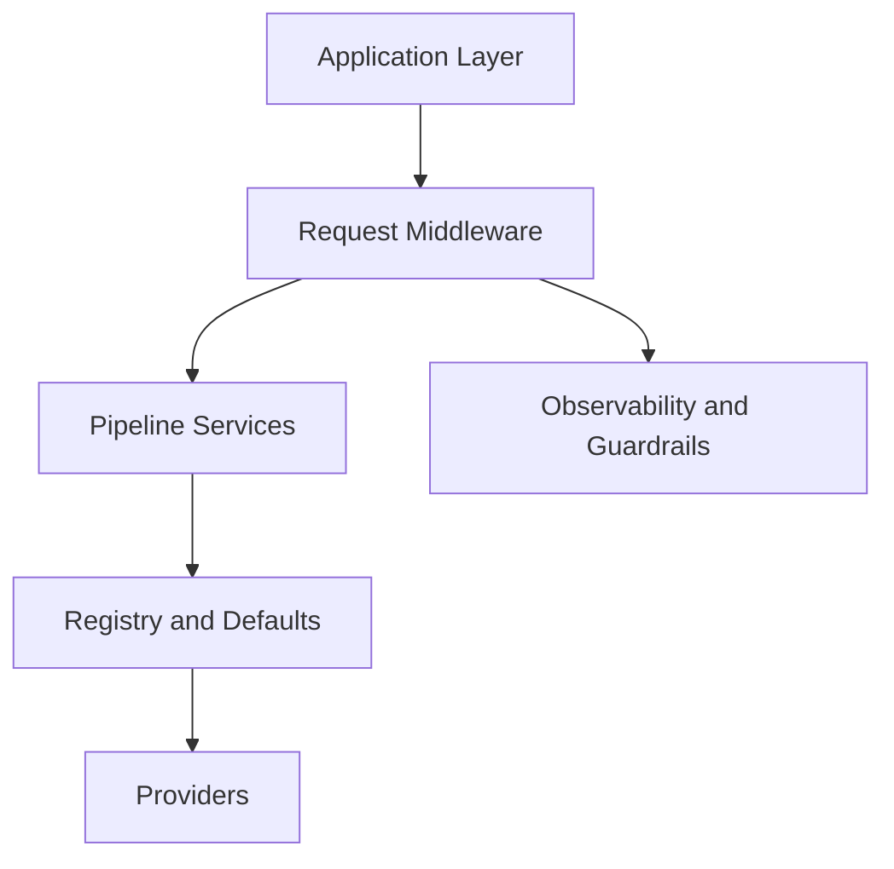

# Architecture

This document describes the current SyRAG architecture and the boundaries it exposes as public framework seams.

## Design Goals

- keep the app surface as small and familiar as FastAPI
- isolate pipeline stages behind typed contracts
- support provider replacement without rewriting route handlers
- make observability, security, and multi-tenancy part of the core design
- keep the service layer stateless enough for normal ASGI deployment patterns

## High-Level Layers

### 1. Application Layer

This layer is the `SyRAG` wrapper around `FastAPI`. It owns:

- `SyRAG` app initialization
- `@app.ingest(...)` and `@app.query(...)` decorators
- request validation through Pydantic models
- automatic OpenAPI generation
- the built-in `/health` route

This layer stays thin. Application handlers can adjust the typed request, but pipeline execution remains inside framework services.

### 2. Request Middleware

Request middleware runs before route execution and owns framework-managed request state:

- request ID assignment
- request-context enrichment
- auth hook execution
- tenant normalization
- rate limiting
- request tracing and request-level structured logging
- response headers such as `x-request-id`

This keeps request-scoped concerns out of application handlers and provider code.

### 3. Pipeline Services

The pipeline is explicit rather than monolithic. Today it is split into:

- ingest pipeline: source documents -> chunks -> embeddings -> vector store upsert
- retrieval strategy: query embedding -> vector store query -> retrieved chunks
- prompt assembly: query plus retrieved chunks -> assembled prompt
- generation policy: assembled prompt -> generation request
- LLM generation: generation request -> `RAGResponse`

The framework emits stage events around these boundaries so tracing and structured logging remain aligned with the actual runtime.

### 4. Registry And Defaults

The registry resolves concrete providers for embedders, vector stores, and LLMs. Defaults can come from:

- explicit app registration
- app-level `configure_defaults(...)`
- bootstrap settings that register in-memory defaults through a provider factory

The registry boundary is intentionally narrow. It does not currently implement plugin discovery or tenant-specific provider selection.

### 5. Providers

Providers adapt external or internal implementations to SyRAG protocols. First-party providers currently include:

- `InMemoryEmbedder` for development and tests
- `InMemoryVectorStore` for development and tests
- `InMemoryLLM` for development and tests
- `PassThroughChunker`
- `ChromaVectorStore` behind the `chroma` extra
- `FAISSVectorStore` behind the `faiss` extra
- `SQLiteVectorStore`
- `GoogleEmbedder` and `GoogleLLM` behind the `google` extra
- `OpenAIEmbedder` and `OpenAILLM` behind the `openai` extra

Provider adapters should remain thin. Generation policy, request safety, and tenant normalization belong in the framework, not in provider classes.

Future strategy integrations should prefer adapters over reimplementation. For example, LangChain text splitters and retrievers or LlamaIndex node parsers and retrievers should be wrapped behind SyRAG protocols rather than copied into core.

### 6. Observability And Guardrails

Cross-cutting services currently include:

- `OpenTelemetryTracing`
- `StructuredLogging` and `JSONLogFormatter`
- `InMemoryRateLimiter`
- `DefaultSafetyGuard`
- the SyRAG error taxonomy
- the observability hub that emits stage events

SyRAG depends only on the OpenTelemetry API package. SDK and exporter configuration remain an application concern.

## Query Flow

1. HTTP middleware creates a `RequestContext`.
2. Request-context and auth hooks enrich that context.
3. Rate limiting runs before the route handler.
4. The route handler receives a validated `QueryRequest`.
5. The framework binds tenant scope from request context and payload.
6. The safety guard validates the request.
7. The retrieval strategy embeds the query and queries the vector store.
8. The prompt assembler builds a grounded prompt.
9. The generation policy creates the final `GenerationRequest`.
10. The LLM returns a typed `RAGResponse`.
11. Structured logs, traces, and error handling reflect the same stage boundaries.

## Ingest Flow

1. HTTP middleware creates and enriches `RequestContext`.
2. Rate limiting and tenant binding run before pipeline work.
3. The safety guard validates the ingest request.
4. Raw strings become `SourceDocument` records.
5. The chunker emits `DocumentChunk` values.
6. The embedder generates vectors for chunk content.
7. The vector store upserts chunks and embeddings in the collection and tenant namespace.
8. The framework returns `IngestResponse`.

## Multi-Tenancy

Tenant identity is framework-managed:

- `RequestContext` carries `tenant_id`
- the default request-context hook reads `x-tenant-id`
- query and ingest payloads still accept `tenant_id`
- mismatches between payload and request context raise a structured validation error
- vector stores receive both `collection` and `tenant_id`

## Failure Model

Failures are categorized and serialized consistently:

- validation errors are returned before pipeline execution
- safety and auth failures map to explicit framework error types
- provider request failures and provider response failures are distinct
- stage names are preserved in error payloads, logs, and tracing
- throttled responses include `retry-after`

## Packaging Boundaries

The package boundary is explicit:

- core package: framework surface, development/test in-memory providers, SQLite vector store, tracing API integration
- `chroma` extra: Chroma vector store provider for local vector search and Chroma-backed deployments
- `faiss` extra: FAISS vector store provider for local vector indexing
- `google` extra: Google Gen AI providers
- `langchain` extra: LangChain strategy adapters
- `llamaindex` extra: LlamaIndex strategy adapters
- `openai` extra: OpenAI providers
- `testing` extra: HTTPX-based test toolkit
- `server` extra: bundled local server runner dependency

## Intentional Non-Goals

The current architecture does not yet include:

- provider plugin discovery
- streaming query responses
- built-in metrics export
- background job orchestration
- post-processor protocols beyond the first `Reranker` seam

## Planned Integration Direction

The next major architecture step should be integration adapters:

- `syrag.integrations.langchain` for LangChain splitters, retrievers, and tools
- `syrag.integrations.llamaindex` for LlamaIndex node parsers, retrievers, and query/tool wrappers
- optional extras that keep these dependencies out of the core package
- smoke tests that prove each optional integration can be installed and imported independently

This keeps SyRAG focused on the production service boundary while allowing users to reuse mature RAG strategies from existing frameworks.
